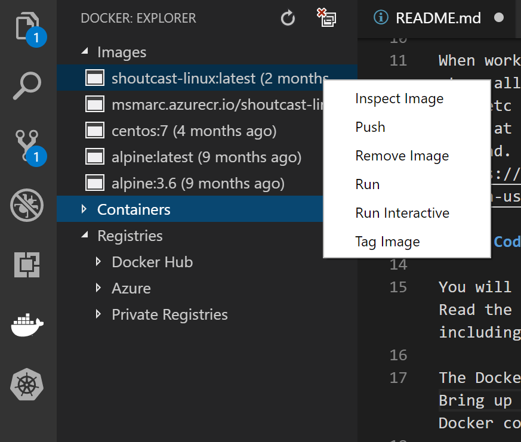
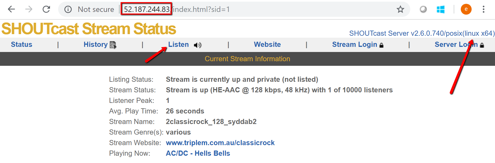

# SHOUTcast-Linux

**Clone** or **Fork & Clone** this GitHub repository to your local machine. Use [Github Desktop](https://desktop.github.com/). Once cloned, open the local repository folder in VS Code. 

## Install Docker for Windows

Install Docker for Windows from [here](https://docs.docker.com/docker-for-windows/install/). I have had more luck with the experimental version, not the stable version.

## Container Registries

When working with containers, you will need a container registry as mandatory to store all your containers so that they are accessible by virtually everything, ACI, AKS etc etc. By default the docker tools use the Docker registry which can be found at http://hub.docker.com. However you can use the Azure Container Registry instead. [Create a container registry using the Azure portal](https://docs.microsoft.com/en-us/azure/container-registry/container-registry-get-started-portal).

## VS Code extension & setup

You will need the Azure based VS Code extensions as well as the Docker extension. Read the follow the directions in the Docker extension to setup your environment including connecting to the Azure Container Registry. 

The Docker extension in VS Code takes care of all the manual Docker command work. Bring up the **VS Code Command Palette (F1)** integration for the most common Docker commands (for example **docker build**, **docker push**, etc.).

With the Docker extension, you can do practically all your common Docker image commands using VS Code.

<p style="text-align:center;"></p>

## Instructions

- Clone this repo **git clone https://github.com/marckean/SHOUTcast-Linux.git**
- Open the folder in VS Code
- Build the image. In VS Code, hit **F1**, then choose **Docker: Build Image**, then tag it with **marcregistry.azurecr.io/shoutcast-linux:latest**.
- Then simply push the image to the Azure Container registry
- Create an Azure Resource Group

    `az group create --name 'SHOUTCAST-Linux' --location australiaeast`

- Create the container in Azure
    
    `az container create --resource-group 'SHOUTCAST-Linux' --name 'shoutcastlinux' --image marcregistry.azurecr.io/shoutcast-linux:latest --registry-username marcregistry --registry-password 'PaSsWoRd' --restart-policy OnFailure --ip-address Public --cpu 1 --memory 1 --ports 80 81 --location australiaeast --verbose`

- Show the container in Azure

    `az container show --resource-group 'SHOUTCAST-Linux' --name 'shoutcastlinux' --out table`

### Test

- Using a popular media player, like Winamp, in Winamp hit **CTRL-L**, open the stream **http://IP-AddressOfContainer**
    - Or with your favourite browser, simply navigate to the IP address of the container. Then click on listen.

<p style="text-align:center;"></p>

# Manual Commands

You can bring up the VS Code **Integrated Terminal** from the View menu and run Docker commands locally if you wish.

### Docker Build

`docker build -t marcregistry.azurecr.io/shoutcast-linux:latest .`

### See all running containers on a host

`docker ps [-all]`

### See all containers that were previously run but that have exited and can be still committed to a new image layer

`docker ps -a`

### Docker commit commits changes in a container that has exited and save it to a new image

`docker commit`

### Docker stop a container

`docker stop <container-name>`

### Search the docker hub for container images:

`docker search microsoft`

### Pull an image down from the Docker Hub 

```
docker pull microsoft/iis
docker pull microsoft/windowsservercore:1709
docker pull marcregistry.azurecr.io/windowsservercore
```

### You can run a command in an existing container ID 002

`docker exec -it 002 cmd`

### You can run a command in an existing container ID 002, to get network information, IP address e.g.

```
docker inspect 002
docker inspect -f "{{ .NetworkSettings.Networks.nat.IPAddress }}" marcregistry.azurecr.io/shoutcastwin

docker ps -a
```

### Creating a new container image with no image name

 `docker commit`

### You can give a name to a container image by using the docker tag command

`docker tag <IMAGE ID> mycontainerimage`

### To list all container images

`docker images`

### To clean up docker containers

`docker rm 8b f2 002 b1`

`docker rm $(docker ps -a -q)`

### Logging in to the Docker Registry

Before we can push an image to the registry we need to login. This can be done using the following command-line

`docker login -u <username> -p <password> http://<registryname>-on.azurecr.io`

Change the parameters above to suite your environment.

From this moment on, all commands that interact with the registry are authenticated. If you are using these commands as part of your build scripts it is wise to also use the logout command, so the credentials are never left open on the machine.

# Kubernetes

Once your container has been built and is in the container registry, you are ready to deploy it using Kubernetes.

## Quick recap on [Kubernetes](https://en.wikipedia.org/wiki/Kubernetes):

- **Pods** | A **pod** consists of one or more **containers** that are guaranteed to be co-located on the host machine and can share resources. Each pod in Kubernetes is assigned a unique IP address within the cluster, which allows applications to use ports without the risk of conflict.

- **Nodes** | also known as Worker or Minion, is a machine where containers (workloads) are deployed. Every **node** in the cluster must run a container runtime such as Docker, as well as the below-mentioned components, for communication with master for network configuration of these containers

- **Kubelet** | is responsible for the running state of each **node**, ensuring that all containers on the node are healthy. It takes care of starting, stopping, and maintaining application containers organised into **pods** as directed by the control plane. **Kubelet** monitors the state of a **pod**, and if not in the desired state, the pod re-deploys to the same **node**. Node status is relayed every few seconds via heartbeat messages to the master. Once the master detects a node failure, the Replication Controller observes this state change and launches pods on other healthy **nodes**.

- **Services** | A Kubernetes service is a set of pods that work together, such as one tier of a multi-tier application. The set of pods that constitute a service are defined by a label selector. Kubernetes provides service discovery and request routing by assigning a stable IP address and DNS name to the service,and load balances traffic in a round-robin manner to network connections of that IP address among the pods matching the selector (even as failures cause the pods to move from machine to machine). By default a service is exposed inside a cluster (e.g. back end pods might be grouped into a service, with requests from the front-end pods load-balanced among them), but a service can also be exposed outside a cluster (e.g. for clients to reach frontend pods)

- **Volume** | a local disk directory or a network disk

## Run applications in Azure Container Service (AKS)
From here https://docs.microsoft.com/en-us/azure/aks/tutorial-kubernetes-deploy-application

[Install the Windows Subsystem for Linux](https://docs.microsoft.com/en-us/windows/wsl/install-win10)

### Create a Resource Group

`az group create --name <ResourceGroupName> --location AustraliaEast`

### Create Kubernetes cluster

`az aks create --resource-group <ResourceGroupName> --name <AKSName> --node-count 2 --generate-ssh-keys --location AustraliaEast`

This take a while to complete.

### Connect with kubectl

`az aks get-credentials --resource-group=<ResourceGroupName> --name=<AKSName>`

### Configure Kubernetes to use your ACR

`kubectl create secret docker-registry <SECRET_NAME> --docker-server <REGISTRY_NAME>.azurecr.io --docker-email=<YOUR_EMAIL> --docker-username=<USERNAME> --docker-password <PASSWORD>`

### Check the Azure Container Registry login server

`az acr list --resource-group ContainerRegistry --query "[].{acrLoginServer:loginServer}" --output table`

### Create Kubernetes cluster

`az aks create --resource-group <ResourceGroupName> --name <AKS-Name> --node-count 2 --generate-ssh-keys --location AustraliaEast`

### Start Kubernetes dashboard

`az aks browse --resource-group <ResourceGroupName> --name <AKS-Name>`

### Connect with kubectl

`az aks get-credentials --resource-group=<ResourceGroupName> --name=<AKS-Name>`

### Configure Kubernetes to use your ACR

`kubectl create secret docker-registry aks-secret20180105 --docker-server <registryname>.azurecr.io --docker-email=<email> --docker-username=<username> --docker-password <password>`


